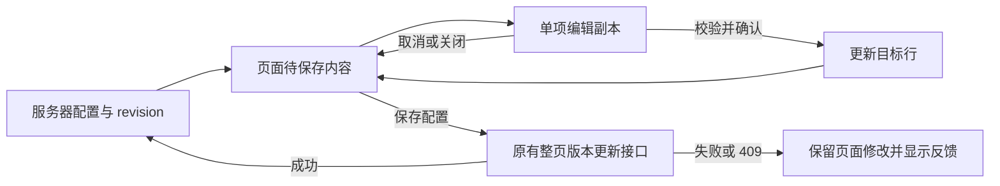

# 制作人社区后台列表与弹窗设计

## 目标与边界

以紧凑列表维护入口，通过 Dialog 新增或编辑单个入口。改动归属 `apps/web` 的社区管理页，沿用现有后台布局和设计令牌。接口、权限、存储格式和公开社区的展示规则不变。

规范来源为 `apps/web/.rules`、`apps/web/DESIGN.md`、Web 组件规范以及社区配置规范。源码依据见 [研究记录](research/source-baseline.md)。

## 页面布局

```text
制作人社区                              [重新读取] [保存配置]
管理社区首页文字、入口与展示范围。
● 已同步 / 有未保存修改 / 正在保存 / 读取失败 / 配置冲突

┌ 基础设置 ──────────────────────────────────────────────┐
│ 页面标题                 页面简介                       │
│ [制作人社区          ]   [浏览制作人社群……            ] │
└────────────────────────────────────────────────────────┘

┌ 社区入口 · 5 个入口                         [新增入口] ┐
│ 顺序   入口与说明          地址        范围   状态 操作 │
│ 1      图标 + 名片交换…    /community… 全端   显示 …    │
│ 2      图标 + 社区动态     /events     App    显示 …    │
│ …                                                      │
└────────────────────────────────────────────────────────┘
```

- 页头使用 `AdminPageHeader.actions` 放置重新读取和保存，保持与现有后台页头的对齐。
- 基础设置使用一个 `AdminPanel`。桌面标题与简介并列，窄屏纵向排列。
- 入口使用独立 `AdminPanel`，面板标题旁显示真实入口数，新增按钮放在右上角。
- 列表使用共享 `Table`；行内不出现输入框或大块编辑表单。
- 图标或图片置于 36px 中性预览框，名称为主要文字，说明采用较小的辅助文字，最多显示两行。完整说明在编辑弹窗中查看。
- 链接用等宽辅助文字显示并截断，保留完整可访问信息。范围与显示状态用现有 Badge 样式表达，交换条件用文字标注。
- 状态反馈使用 Badge、Alert、Skeleton 和现有语义色；不新增统计卡片、背景材质或全局令牌。

## 列表操作与响应式

### 桌面

显示顺序、入口、地址、范围、状态和操作列。操作区采用带可访问名称的紧凑图标按钮：上移、下移、编辑、删除。首项上移及末项下移禁用。隐藏项仍保留在管理列表，状态标为“隐藏”。

### 窄屏

保留入口与操作两列，将顺序、范围和状态合并到入口说明下方。编辑保持为直接可见的按钮；排序和删除放入“更多操作”菜单。菜单使用已安装的 `@base-ui/react/menu` Portal，不在表格滚动容器内自行定位。

窄屏按钮及菜单行提供至少 44px 的触摸目标，不能依赖 hover 才能发现操作。长名称和链接不得撑宽页面。空列表使用 `AdminEmptyState`，面板中的新增按钮仍可用；该空状态只属于后台，公共社区仍留空。

## 新增与编辑 Dialog

使用 `DialogContent layout="pinned"`、`DialogHeader`、`DialogBody` 和 `DialogFooter`。若外层有 form，使用 `flex min-h-0 flex-1 flex-col`，保持完整的收缩链。只允许 `DialogBody` 滚动，标题、关闭按钮和底部操作始终可见。

沿用 `safeArea="inset"` 的安全区尺寸，不设置会被原语覆盖的 `w-*` 或 `max-h-*`。桌面可通过 `sm:max-w-3xl` 调整最大宽度；窄屏由原语控制可用宽高。

### 表单组织

桌面采用两栏：左侧维护名称、ID、地址、说明、展示范围、展示条件和显示开关；右侧是默认图标、自定义图片和预览。窄屏改为同一滚动区域内的纵向分组。

- 字段复用 `AdminField`、`Input`、`Textarea`、`Select` 和 `Checkbox`。
- 文本说明使用正常正文字体，不继承用于源码编辑的等宽 textarea 字体。
- 默认图标继续使用完整 `LucideIconPicker`；自定义图片继续使用 `AdminImageUploadField`。
- 图片预览使用 `object-contain`。清除图片只清除引用，恢复当前所选图标。
- 新增表单延续当前单项初始值：随机 ID、“新入口”、`/community`、`users`、全端、显示、始终展示、无自定义图片。它不是公共页面默认入口。
- ID 字段维持现有可编辑能力，确认时检查格式和与其他项的唯一性；会话目标仍由打开时的原 ID 标识。

弹窗标题区提示：“完成编辑后，使用页面‘保存配置’统一保存。”新增确认按钮为“添加入口”，编辑确认为“完成编辑”。另提供“取消”和具名关闭按钮。

## 编辑状态与保存流程



### 页面状态

保留页面的 draft、revision、读取完成状态和冲突状态。读取、保存使用页面处理状态；编辑弹窗和图片上传使用各自状态，不能继续用一个全局 busy 混合所有操作。

全页修改是否尚未保存，按当前内容与最近成功读取或保存的基线比较。无更改的编辑确认不制造脏状态；用户把修改恢复为基线后，保存按钮可以再次禁用。反馈只表达当前真实状态。

### 编辑会话

会话至少持有独立 token、模式、原 ID、原值、候选值、字段错误及上传状态。打开时复制入口；输入只更新该副本，不调用页面的 entryChange。新增在确认前不向列表追加任何项。

确认时使用现有 `communityContentEntrySchema` 校验单项，再检查与其他行的 ID 冲突和必要的空白文本提示。Schema 从 Web API facade 取得：在 `app/lib/api/endpoints/community-content.ts` 增加已有 schema 的具名导入与 re-export，不修改 contracts 源码或新建另一份 wire schema。安全链接及图片归属最终仍由原后端验证。

编辑目标以原 ID 查找，排序和删除也使用入口 ID 定位。若目标已不存在，应保留弹窗输入并报错，不能把候选值写入相同下标上的另一项。候选值没有变化时，只关闭弹窗。

取消、Escape 和点击遮罩使用同一丢弃会话动作。关闭后焦点回到触发控件；ID 变更造成原行按钮重新挂载时，回到新 ID 对应的编辑按钮，必要时回退到新增按钮。

### 配置提交

弹窗确认、排序和删除只修改页面待保存内容。`updateAdminCommunityContent` 仍仅由“保存配置”调用，包含当前 revision。保存成功用返回的完整内容和 revision 重建基线；普通保存失败保留内容并允许重试，409 保留内容并继续禁止覆盖。

读取失败时，列表和编辑不可继续修改，也不能把缺少数据解释为空配置。重新读取仍按已有流程确认丢弃未保存内容。

## 图片上传归属

图片上传请求带会话 token 和本次上传序号。响应、失败和 finally 处理只有在两者仍匹配时才能更新当前弹窗。不要把旧闭包中的列表下标作为写入目标。

上传处理中显示反馈，并禁用确认、关闭、取消和新上传；弹窗的 onOpenChange 也阻止 Escape 或遮罩关闭。路由卸载或其他原因销毁会话后，迟到响应必须忽略。

上传成功仅写入候选值，确认后进入页面内容，保存配置后成为公开引用。取消或清除引用不会删除已成功上传的服务器素材，沿用现有对未保存及并行编辑的素材保留策略。上传失败保留填写内容和原图片，允许重试。

## 文件边界

| 文件 | 责任 |
| --- | --- |
| `app/pages/admin/community/index.tsx` | 配置读取、基线、整页保存、排序删除与会话衔接 |
| `app/pages/admin/community/community-model.ts`（新增） | 单项初始值、显示标签、候选校验和内容比较等纯逻辑 |
| `app/pages/admin/community/components/community-entry-list.tsx`（新增） | 表格、窄屏元数据和菜单、入口操作 |
| `app/pages/admin/community/components/community-entry-editor-dialog.tsx`（新增） | 独立候选表单、Dialog、上传状态及会话校验 |
| `app/pages/admin/community/components/community-entry-editor.tsx` | 迁移字段与图片能力后移除旧展开式编辑器 |
| `app/lib/api/endpoints/community-content.ts` | 具名导出已有单项 schema；请求和协议不变 |
| 社区管理 unit 与 E2E | 保留现有回归，增加取消、未更改、上传归属与焦点验证 |

不引入页面私有 barrel，不修改共享 Dialog、Table、上传字段或后台布局。若现有共享组件确有缺陷，先提交证据与范围变化再扩展任务。

## 验收与回退

验收按 [PRD](prd.md) AC1–AC7 和 [实施计划](implement.md)执行。检查桌面、320×568 手机、长中文文本、长地址、100 项限制以及错误状态。浏览器必须实际确认表单底部可达、焦点返回、菜单可触达和无横向溢出。

本任务无数据迁移。回退仅恢复社区页的视图与状态实现；服务器配置、素材和保存协议保持兼容。

## 设计预览说明

[可交互预览](design-preview.html)和 `preview-assets.js` 仅供评审。示例是生成预览时读取的 5 项 Preview 配置，SVG 来自现有 Lucide 组件。它们不被应用导入，也不决定产品默认数据。

预览支持列表、新增、编辑、取消、排序、删除及本页保存演示；图片只生成本地预览。图标选择仅展示常用示例，产品实施仍使用完整图标选择器。该预览不证明真实上传、权限、CSRF 或 409 行为，相关验证留在正式页面测试中。

## 实施校正

基线没有共享 DropdownMenu 原语。经主会话批准，列表内直接使用已安装的 Base UI Menu 的 Portal、Positioner、Popup 和 Item，保留键盘、禁用边界项及 44px 菜单行；不新增共享组件或依赖。
